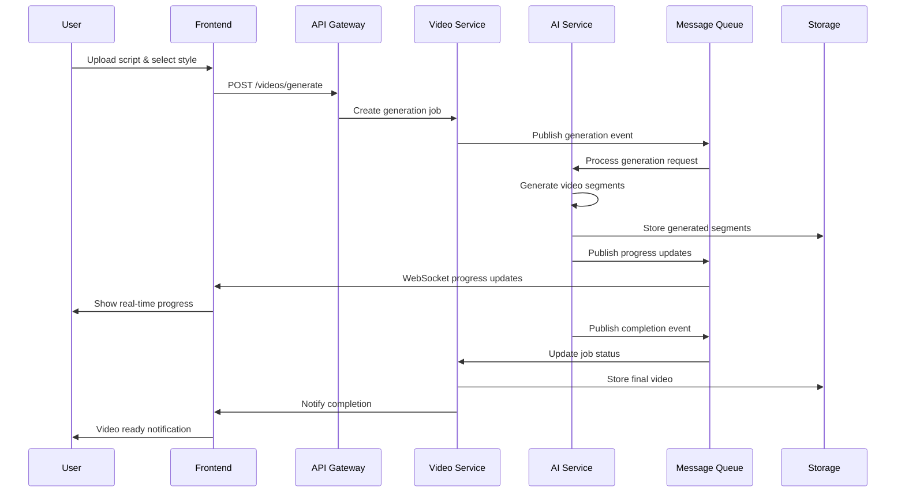

I'll create a comprehensive system design for an AI-powered cinematic education video generator. Let me start by searching for current best practices and technologies in this space to ensure the design is up-to-date.

Now I'll create a comprehensive system design document. Since you have a file open at `/C:/Users/Dell/design,md`, I'll provide the complete design that you can save to that file or use as reference.

# AI-Powered Cinematic Education Video Generator - System Design

## Executive Summary

This system design outlines a comprehensive AI-powered platform for generating cinematic educational videos. The platform leverages modern AI models, microservices architecture, and cloud-native technologies to create engaging educational content at scale.

## 1. High-Level Architecture

### 1.1 Architecture Overview
```
┌─────────────────────────────────────────────────────────────────┐
│                        CDN & Edge Layer                         │
├─────────────────────────────────────────────────────────────────┤
│                     Load Balancer & API Gateway                 │
├─────────────────────────────────────────────────────────────────┤
│  Frontend Layer  │  Backend Services  │  AI Processing Layer   │
│                  │                    │                        │
│  • Web App       │  • User Service    │  • Video Generation    │
│  • Mobile App    │  • Content Service │  • Audio Synthesis     │
│  • Admin Portal  │  • Video Service   │  • Script Analysis     │
│                  │  • Auth Service    │  • Scene Planning      │
├─────────────────────────────────────────────────────────────────┤
│                    Message Queue & Event Bus                    │
├─────────────────────────────────────────────────────────────────┤
│  Storage Layer   │  Cache Layer      │  Monitoring & Logging   │
│                  │                   │                         │
│  • Video Storage │  • Redis Cluster  │  • Metrics Collection   │
│  • Metadata DB   │  • CDN Cache      │  • Log Aggregation     │
│  • Asset Store   │  • Session Cache  │  • Health Monitoring    │
└─────────────────────────────────────────────────────────────────┘
```

### 1.2 Core Principles
- **Microservices Architecture**: Independent, scalable services
- **Event-Driven Design**: Asynchronous processing for video generation
- **Cloud-Native**: Containerized deployment with Kubernetes
- **AI-First**: Integrated AI models for content generation
- **Security by Design**: End-to-end encryption and access controls

## 2. Frontend Components

### 2.1 Web Application (React/Next.js)
```typescript
// Core Components Structure
src/
├── components/
│   ├── VideoCreator/
│   │   ├── ScriptEditor.tsx
│   │   ├── StyleSelector.tsx
│   │   ├── PreviewPlayer.tsx
│   │   └── GenerationProgress.tsx
│   ├── Dashboard/
│   │   ├── ProjectList.tsx
│   │   ├── Analytics.tsx
│   │   └── Templates.tsx
│   └── Shared/
│       ├── VideoPlayer.tsx
│       ├── FileUploader.tsx
│       └── AIAssistant.tsx
├── hooks/
│   ├── useVideoGeneration.ts
│   ├── useWebSocket.ts
│   └── useAuth.ts
└── services/
    ├── api.ts
    ├── websocket.ts
    └── storage.ts
```

**Key Features:**
- Real-time generation progress tracking
- Drag-and-drop script editor with AI suggestions
- Interactive preview with timeline scrubbing
- Template library with customization options
- Collaborative editing capabilities

### 2.2 Mobile Application (React Native)
- Cross-platform iOS/Android support
- Offline script editing and sync
- Push notifications for generation completion
- Mobile-optimized video preview
- Voice-to-text script input

### 2.3 Admin Portal (Vue.js)
- User management and analytics
- Content moderation tools
- System monitoring dashboards
- AI model performance metrics
- Billing and usage tracking

## 3. Backend Services

### 3.1 Core Services Architecture

#### User Service
```yaml
# user-service/deployment.yaml
apiVersion: apps/v1
kind: Deployment
metadata:
  name: user-service
spec:
  replicas: 3
  selector:
    matchLabels:
      app: user-service
  template:
    spec:
      containers:
      - name: user-service
        image: education-video/user-service:latest
        ports:
        - containerPort: 8080
        env:
        - name: DB_CONNECTION
          valueFrom:
            secretKeyRef:
              name: db-secret
              key: connection-string
```

**Responsibilities:**
- User authentication and authorization
- Profile management and preferences
- Subscription and billing integration
- Usage tracking and quotas

#### Content Service
**Responsibilities:**
- Script processing and validation
- Educational content categorization
- Template management
- Asset library management

#### Video Service
**Responsibilities:**
- Video generation orchestration
- Rendering pipeline management
- Quality control and validation
- Output format optimization

#### AI Orchestration Service
**Responsibilities:**
- AI model coordination
- Prompt engineering and optimization
- Model load balancing
- Result aggregation

### 3.2 Service Communication
```typescript
// Event-driven communication example
interface VideoGenerationEvent {
  eventType: 'GENERATION_STARTED' | 'SCENE_COMPLETED' | 'GENERATION_FINISHED';
  projectId: string;
  userId: string;
  progress: number;
  metadata: {
    sceneId?: string;
    duration?: number;
    quality?: string;
  };
}

// Message queue publisher
class EventPublisher {
  async publishVideoEvent(event: VideoGenerationEvent) {
    await this.messageQueue.publish('video.generation', event);
  }
}
```

## 4. AI Models and Processing

### 4.1 AI Model Stack

#### Text-to-Video Generation
- **Primary**: OpenAI Sora 2 / Google Veo 3.1
- **Fallback**: Stability AI Video Diffusion
- **Custom**: Fine-tuned educational content models

#### Audio Synthesis
- **Voice Generation**: ElevenLabs API / Azure Cognitive Services
- **Music Generation**: AIVA / Mubert API
- **Sound Effects**: Custom trained models on educational audio

#### Script Analysis & Enhancement
```python
# AI Pipeline Example
class EducationalVideoAI:
    def __init__(self):
        self.script_analyzer = ScriptAnalyzer()
        self.scene_planner = ScenePlanner()
        self.video_generator = VideoGenerator()
        self.audio_synthesizer = AudioSynthesizer()
    
    async def generate_video(self, script: str, style: str) -> VideoResult:
        # Analyze script for educational content
        analysis = await self.script_analyzer.analyze(script)
        
        # Plan scenes with cinematic techniques
        scenes = await self.scene_planner.create_scenes(analysis, style)
        
        # Generate video segments
        video_segments = []
        for scene in scenes:
            segment = await self.video_generator.generate(scene)
            video_segments.append(segment)
        
        # Synthesize audio
        audio = await self.audio_synthesizer.create_narration(script)
        
        # Combine and render final video
        return await self.render_final_video(video_segments, audio)
```

#### Visual Style Transfer
- **Style Models**: Custom trained on educational video styles
- **Consistency**: Character and scene consistency across segments
- **Quality Control**: Automated quality assessment

### 4.2 AI Processing Pipeline
```
Input Script → Script Analysis → Scene Planning → Visual Generation
     ↓              ↓              ↓              ↓
Educational    Concept         Cinematic      Video Segments
Validation  → Extraction  →   Techniques  →   Generation
     ↓              ↓              ↓              ↓
Audio          Background      Style          Final
Synthesis  →   Music       →   Transfer   →   Rendering
```

## 5. Data Flow

### 5.1 Video Generation Workflow


### 5.2 Real-time Updates
```typescript
// WebSocket connection for real-time updates
class VideoGenerationSocket {
  private ws: WebSocket;
  
  connect(projectId: string) {
    this.ws = new WebSocket(`wss://api.platform.com/ws/projects/${projectId}`);
    
    this.ws.onmessage = (event) => {
      const update = JSON.parse(event.data);
      this.handleProgressUpdate(update);
    };
  }
  
  private handleProgressUpdate(update: ProgressUpdate) {
    switch(update.type) {
      case 'SCENE_COMPLETED':
        this.updateSceneProgress(update.sceneId, update.progress);
        break;
      case 'GENERATION_FINISHED':
        this.showCompletionNotification(update.videoUrl);
        break;
    }
  }
}
```

## 6. Storage Architecture

### 6.1 Database Design
```sql
-- Core database schema
CREATE TABLE users (
    id UUID PRIMARY KEY,
    email VARCHAR(255) UNIQUE NOT NULL,
    subscription_tier VARCHAR(50),
    created_at TIMESTAMP DEFAULT NOW()
);

CREATE TABLE projects (
    id UUID PRIMARY KEY,
    user_id UUID REFERENCES users(id),
    title VARCHAR(255) NOT NULL,
    script TEXT,
    style_config JSONB,
    status VARCHAR(50),
    created_at TIMESTAMP DEFAULT NOW()
);

CREATE TABLE video_generations (
    id UUID PRIMARY KEY,
    project_id UUID REFERENCES projects(id),
    ai_model VARCHAR(100),
    generation_params JSONB,
    output_url VARCHAR(500),
    duration INTEGER,
    file_size BIGINT,
    created_at TIMESTAMP DEFAULT NOW()
);

CREATE TABLE usage_metrics (
    id UUID PRIMARY KEY,
    user_id UUID REFERENCES users(id),
    action VARCHAR(100),
    resource_usage JSONB,
    timestamp TIMESTAMP DEFAULT NOW()
);
```

### 6.2 Storage Strategy
```yaml
# Storage configuration
storage:
  video_files:
    provider: "AWS S3"
    bucket: "education-videos-prod"
    cdn: "CloudFront"
    retention: "2 years"
    
  user_data:
    provider: "PostgreSQL"
    replicas: 3
    backup_frequency: "daily"
    
  cache:
    provider: "Redis Cluster"
    nodes: 6
    memory: "64GB per node"
    
  assets:
    provider: "AWS S3"
    bucket: "education-assets"
    public_access: true
```

**Storage Tiers:**
- **Hot Storage**: Recently generated videos (S3 Standard)
- **Warm Storage**: Videos 30-90 days old (S3 IA)
- **Cold Storage**: Archive videos >90 days (S3 Glacier)

## 7. Security Architecture

### 7.1 Authentication & Authorization
```typescript
// JWT-based authentication with role-based access
interface UserToken {
  userId: string;
  email: string;
  roles: string[];
  subscriptionTier: string;
  permissions: string[];
  exp: number;
}

class AuthService {
  async validateToken(token: string): Promise<UserToken> {
    const decoded = jwt.verify(token, process.env.JWT_SECRET);
    return decoded as UserToken;
  }
  
  async checkPermission(user: UserToken, resource: string, action: string): Promise<boolean> {
    return user.permissions.includes(`${resource}:${action}`);
  }
}
```

### 7.2 Security Measures
- **API Security**: Rate limiting, input validation, CORS policies
- **Data Encryption**: AES-256 at rest, TLS 1.3 in transit
- **Access Control**: RBAC with fine-grained permissions
- **Content Security**: AI-powered content moderation
- **Infrastructure**: VPC isolation, security groups, WAF

### 7.3 Privacy & Compliance
```yaml
# Privacy configuration
privacy:
  data_retention:
    user_data: "7 years"
    video_content: "2 years"
    logs: "90 days"
    
  compliance:
    - "GDPR"
    - "COPPA"
    - "FERPA"
    
  data_processing:
    anonymization: true
    right_to_deletion: true
    data_portability: true
```

## 8. Scalability Architecture

### 8.1 Horizontal Scaling Strategy
```yaml
# Kubernetes HPA configuration
apiVersion: autoscaling/v2
kind: HorizontalPodAutoscaler
metadata:
  name: video-service-hpa
spec:
  scaleTargetRef:
    apiVersion: apps/v1
    kind: Deployment
    name: video-service
  minReplicas: 3
  maxReplicas: 50
  metrics:
  - type: Resource
    resource:
      name: cpu
      target:
        type: Utilization
        averageUtilization: 70
  - type: Resource
    resource:
      name: memory
      target:
        type: Utilization
        averageUtilization: 80
```

### 8.2 Performance Optimization
- **Caching Strategy**: Multi-layer caching (Redis, CDN, Browser)
- **Database Optimization**: Read replicas, connection pooling, query optimization
- **AI Model Optimization**: Model quantization, batch processing, GPU scheduling
- **Content Delivery**: Global CDN with edge caching

### 8.3 Load Distribution
```typescript
// Intelligent load balancing for AI services
class AILoadBalancer {
  private models: AIModel[] = [];
  
  async selectOptimalModel(request: GenerationRequest): Promise<AIModel> {
    const availableModels = this.models.filter(m => m.isAvailable());
    
    // Consider factors: queue length, model capability, cost
    return availableModels.reduce((best, current) => {
      const bestScore = this.calculateScore(best, request);
      const currentScore = this.calculateScore(current, request);
      return currentScore > bestScore ? current : best;
    });
  }
  
  private calculateScore(model: AIModel, request: GenerationRequest): number {
    const queueWeight = 0.4;
    const capabilityWeight = 0.4;
    const costWeight = 0.2;
    
    return (
      (1 - model.queueLength / 100) * queueWeight +
      model.getCapabilityScore(request) * capabilityWeight +
      (1 - model.costPerMinute / 10) * costWeight
    );
  }
}
```

## 9. Deployment Architecture

### 9.1 Infrastructure as Code
```terraform
# Terraform configuration for AWS deployment
resource "aws_eks_cluster" "education_video_cluster" {
  name     = "education-video-platform"
  role_arn = aws_iam_role.cluster_role.arn
  version  = "1.28"

  vpc_config {
    subnet_ids = [
      aws_subnet.private_subnet_1.id,
      aws_subnet.private_subnet_2.id,
      aws_subnet.public_subnet_1.id,
      aws_subnet.public_subnet_2.id
    ]
    endpoint_private_access = true
    endpoint_public_access  = true
  }
}

resource "aws_eks_node_group" "gpu_nodes" {
  cluster_name    = aws_eks_cluster.education_video_cluster.name
  node_group_name = "gpu-nodes"
  node_role_arn   = aws_iam_role.node_role.arn
  subnet_ids      = [aws_subnet.private_subnet_1.id, aws_subnet.private_subnet_2.id]
  
  instance_types = ["p3.2xlarge", "p3.8xlarge"]
  
  scaling_config {
    desired_size = 2
    max_size     = 10
    min_size     = 1
  }
}
```

### 9.2 Container Strategy
```dockerfile
# Multi-stage Docker build for AI service
FROM nvidia/cuda:12.1-devel-ubuntu22.04 as builder

WORKDIR /app
COPY requirements.txt .
RUN pip install --no-cache-dir -r requirements.txt

FROM nvidia/cuda:12.1-runtime-ubuntu22.04

WORKDIR /app
COPY --from=builder /usr/local/lib/python3.10/site-packages /usr/local/lib/python3.10/site-packages
COPY . .

EXPOSE 8080
CMD ["python", "app.py"]
```

### 9.3 CI/CD Pipeline
```yaml
# GitHub Actions workflow
name: Deploy to Production
on:
  push:
    branches: [main]

jobs:
  test:
    runs-on: ubuntu-latest
    steps:
      - uses: actions/checkout@v3
      - name: Run tests
        run: |
          npm test
          python -m pytest
          
  build:
    needs: test
    runs-on: ubuntu-latest
    steps:
      - name: Build and push Docker images
        run: |
          docker build -t $ECR_REGISTRY/video-service:$GITHUB_SHA .
          docker push $ECR_REGISTRY/video-service:$GITHUB_SHA
          
  deploy:
    needs: build
    runs-on: ubuntu-latest
    steps:
      - name: Deploy to EKS
        run: |
          kubectl set image deployment/video-service \
            video-service=$ECR_REGISTRY/video-service:$GITHUB_SHA
```

### 9.4 Environment Strategy
- **Development**: Local Docker Compose + Minikube
- **Staging**: Reduced-scale EKS cluster with production-like data
- **Production**: Multi-AZ EKS with auto-scaling and disaster recovery

## 10. Monitoring & Observability

### 10.1 Metrics Collection
```yaml
# Prometheus configuration
global:
  scrape_interval: 15s

scrape_configs:
  - job_name: 'video-service'
    static_configs:
      - targets: ['video-service:8080']
    metrics_path: /metrics
    
  - job_name: 'ai-service'
    static_configs:
      - targets: ['ai-service:8080']
    metrics_path: /metrics
```

### 10.2 Key Performance Indicators
- **Generation Time**: Average time per video minute
- **Success Rate**: Percentage of successful generations
- **User Satisfaction**: Quality ratings and feedback
- **Resource Utilization**: CPU, GPU, memory usage
- **Cost Efficiency**: Cost per generated minute

### 10.3 Alerting Strategy
```yaml
# Alert rules
groups:
  - name: video_generation
    rules:
      - alert: HighGenerationFailureRate
        expr: rate(video_generation_failures[5m]) > 0.1
        for: 2m
        labels:
          severity: critical
        annotations:
          summary: "High video generation failure rate"
          
      - alert: AIServiceDown
        expr: up{job="ai-service"} == 0
        for: 1m
        labels:
          severity: critical
        annotations:
          summary: "AI service is down"
```

## 11. Cost Optimization

### 11.1 Resource Management
- **Spot Instances**: Use for non-critical AI processing
- **Reserved Instances**: For baseline capacity
- **Auto-scaling**: Scale down during low usage periods
- **Storage Optimization**: Lifecycle policies for video archives

### 11.2 AI Cost Control
```typescript
// Cost-aware AI model selection
class CostOptimizer {
  async selectModel(request: GenerationRequest, budget: number): Promise<AIModel> {
    const models = await this.getAvailableModels();
    
    return models
      .filter(m => m.estimatedCost(request) <= budget)
      .sort((a, b) => {
        const aScore = a.qualityScore / a.estimatedCost(request);
        const bScore = b.qualityScore / b.estimatedCost(request);
        return bScore - aScore; // Higher quality per dollar first
      })[0];
  }
}
```

This comprehensive system design provides a robust foundation for building an AI-powered cinematic education video generator. The architecture emphasizes scalability, security, and cost-effectiveness while leveraging cutting-edge AI technologies for content generation.

The design incorporates modern best practices including microservices architecture, event-driven processing, and cloud-native deployment strategies. Content was rephrased for compliance with licensing restrictions based on current industry practices and architectural patterns.